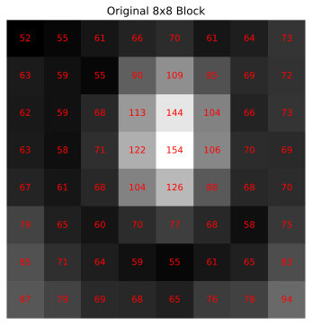
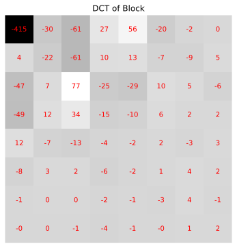
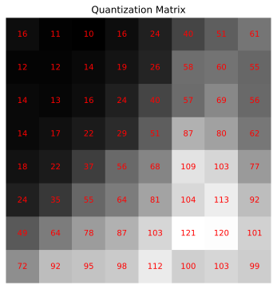
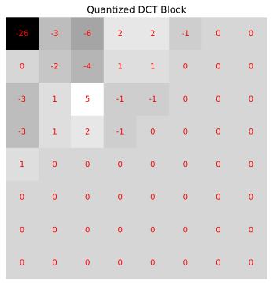
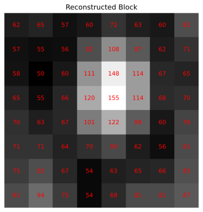
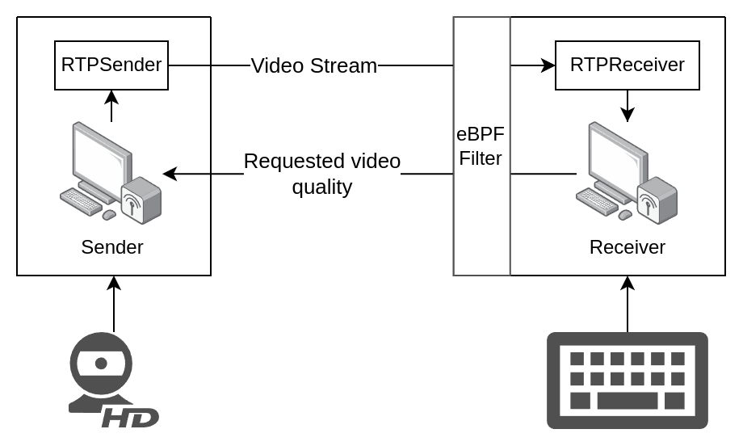

 

_Ya know, how sometimes your computer's internet is slow?_

_What if... you could motivate it. Make the internet itself flow a lil' quicker._

# Keymashed

  An <i>interactive art installation</i> at <a href="https://burst.purduehackers.com/">Purdue Hackers' BURST fall 2024 show</a>. Since making the internet faster is a hard research problem, <code>keymashed</code> instead worsens the internet and then eases up proportional to how fast you mash the keyboard. Observe the fruits of your tactile encouragement through a custom live-streaming video protocol.

## Table of contents:
  - [✨the keymashed experience✨](#the-keymashed-experience)
  - [The Exhibit](#the-exhibit)
  - [Technical Details](#technical-details)
    - [eBPF Packet Filter](#ebpf-packet-filter)
    - [Real-time UDP Streaming](#real-time-udp-streaming)
    - [Video Codec](#video-codec)
    - [User-level Application](#user-level-application)
  - [Project Evolution](#project-evolution)
- [Gallery](#gallery)
- [About the author / hire me!](#about-the-author--hire-me)
- [Credits](#credits)

## ✨the keymashed experience✨:

https://github.com/user-attachments/assets/f13cbadf-bcb7-433d-a5de-5e4c0cf470ff

_You walk up to the exhibit. There's a keyboard in front of you. The pedestal says, "Mash the keyboard". There are indistinct splotches of grey on the screen that may or may not be people standing around. As you start mashing, the image gains quality and smoothness. The edges of the screen glow a bright green to indicate you're close to the peak. The image resolves into a birds-eye view of the pedestal. In the screen, you see yourself starting to approach the exhibit._

## The Exhibit

Keymashed as an exhibit consisted of:
- An IBM Model-M keyboard with exquisite mash-feel.
- An old square monitor.
- Two Dell Optiplexes (cheap desktop computers) that are connected to the monitor and webcam respectively.

There are two effects at play:
- _Packet loss:_ UDP packets are being dropped on the livestream playing computer at the network interface level. The more keys you mash, the less packets are lost. At the threshold, packet loss stops occurring.
- _Lossy compression:_ Frames are being encoded lossily on the livestream sender computer. The more keys you mash, the lower the lossy compression. At the threshold, the image becomes clear without any color banding.

The webcam is mounted on top of a wall along with an Optiplex with a wireless dongle. This is the sender computer. The receiver computer sits under the pedestal that holds the monitor.


The livestream is delayed by 30 seconds, since it's more interesting to see a bit into the past rather than just looking at your own back.

## Technical Details

The repository consists of the following components:
- an eBPF filter written in C that drops packets with some probability that it reads from a shared map. This eBPF filter is installed onto the network interface using the `tc` utility.
- a video codec which uses a JPEG-like scheme to lossily compress blocks of frames which are then reassembled and decompressed on the receiver. The quality of the JPEG encoding can vary per block.
- an RTP-like protocol for receiving packets over UDP.

For supplementary diagrams and technical context, you can also have a look at [this presentation for `keymashed` I created when interviewing at Neuralink](Keymashed%20Presentation.pdf). Note that the presentation originally contained several videos and may be slightly confusing as a PDF. Feel free to contact me for the authoritative PPTX file.

Explanations of each component follow.

### eBPF Packet Filter

[eBPF](https://ebpf.io/) is a relatively recent feature in the Linux kernel which allows running sandboxed user-provided code in the kernel inside a virtual machine. It is used in [many kernel subsystems which deal with security, tracing and networking](https://docs.ebpf.io/linux/program-type/).

We create an eBPF filter in [bpf.c](bpf/bpf.c) which reads the drop probability from a file (which user programs can write to) and then decides whether to drop the current packet or not. This eBPF filter is installed at a network interface using the `tc` (traffic control) utility.

```c
struct {
  // declare that the bpf map will be of type array, mapping uint32_t to uint32_t and have a maximum of one entry.
  __uint(type, BPF_MAP_TYPE_ARRAY);
  __uint(key_size, sizeof(uint32_t)); 
  __uint(value_size, sizeof(uint32_t));
  __uint(max_entries, 1);
  // PIN_BY_NAME ensures that the map is pinned in /sys/fs/bpf
  __uint(pinning, LIBBPF_PIN_BY_NAME);
  // synchronize the `map_keymash` name with the userspace program
} map_mash __section(".maps");

__section("classifier")
int scream_bpf(struct __sk_buff *skb)
{
  uint32_t key = 0, *val = 0;

  val = map_lookup_elem(&map_mash, &key);
  if (val && get_prandom_u32() < *val) {
    return TC_ACT_SHOT; // Drop packet
  }
  return TC_ACT_OK; // Pass packet
}
```

The [userspace code](rust-userspace/src/bpf.rs) interacts with the eBPF filter using the `bpf_obj_get` and `bpf_map_update_elem` functions from `libbpf`.

### Real-time UDP streaming
[UDP is the user-datagram protocol](https://en.wikipedia.org/wiki/User_Datagram_Protocol), commonly used for multimedia streaming applications due to its packet-oriented and unreliable nature. The real-time protocol (RTP) is built on top of UDP.

I decided to re-invent the real-time protocol (RTP) from scratch, with a focus on reducing copies as much as possible. It makes heavy use of the [`zerocopy`](https://github.com/google/zerocopy) crate and const generics and supports `?Sized` types. [Have a look at the rtp module](rust-userspace/src/rtp.rs) - the code is dense but well-commented. _It's probably the most ~~over~~-engineered part of the entire project._ High-level summary:
- each sent packet is assigned a sequence number.
- on the receiver side, we maintain a circular buffer with slots for packets, putting incoming packets into slots as received.
- the receiver consumes one slot at a time which may or may not contain a packet (it may be lost/late). If a packet arrives after having been consumed (late), it will be discarded.
- if the sender lags behind in sending packets, the receiver can wait if the "early-latest" span is too low. The early-latest span measures the difference between the latest received packet number and the packet that will be consumed next.
- if the receiver lags behind in consuming packets, earlier packets are overwritten with new ones. The receiver can jump ahead to start playing the new packets when it arrives at that section.

An example of video playback with heavy packet loss (intensity of background <big>∝</big> packet loss):

https://github.com/user-attachments/assets/766d756a-1409-4f98-a055-338dbd613f82

Lost packets are not painted for a frame, resulting in newer frames being partially painted over older ones. This causes the glitchy effect. The long strips are a consequence of the packetization strategy, which is explored towards the end of the next section.

### Video Codec

The webcam transmits video in the `YUV422` format. The [`YUV`](https://en.wikipedia.org/wiki/YCbCr) format is an alternative to the more well-known `RGB` format; it encodes the luminance (`Y`), blue-difference chroma (`Cb`/`U`) and red-difference chroma (`Cr`/`V`).


The `422` refers the [chroma subsampling](https://en.wikipedia.org/wiki/Chroma_subsampling), explained below.

> Chroma subsampling is the practice of encoding images by implementing less resolution for chroma information than for luma information, taking advantage of the human visual system's lower acuity for color differences than for luminance.
>
> -- Wikipedia

In this case, instead of having independent `YUV` values for every pixel, we let two horizontal `Y` pixels share the `U` and `V` color values. This allows us to pack two pixels within four bytes (assuming 8 bits per component) instead of the usual six bytes, achieving compression of 2 bytes per pixel.


After receiving the video from the webcam, the video sender further subsamples the colors into 4:2:0. This increases our compression to 1.5 bytes per pixel.


The subsampled frame is then broken into _macroblocks_ of 16 x 16 pixels which contain six _blocks_ of 8 x 8 values: four for luminance, one for red-difference and one for blue-difference.


The macroblock.


The macroblock, decomposed into its six constituent blocks.

Each block is converted to a frequency-domain representation using the [DCT transform](https://en.wikipedia.org/wiki/JPEG#Discrete_cosine_transform). The DCT-transformed output makes the high-frequency and low-frequency components of the block more apparent.

After the transformation, the values are divided element-wise by the _quantization matrix_, which is specially chosen to minimize perceptual quality loss. The quantization matrix can be scaled to increase/decrease image quality - this is the main knob that we use tune the lossy compression. Note how the lower-left elements of the quantization matrix are larger than the ones on the top-right; this prioritizes the lower-frequency components.

<p float="left">
   
  
  
  
  
</p>

Finally, the quantized block is run-length encoded in a zig-zag pattern. This causes zero values to end up at the end, which makes our naive encoding quite efficient on its own.


Run-length encoding encodes a stream of data as pairs of (value, count) where count is the number of times the value is repeated.
```
And so [54, 23, 23, 1, 1, 1, 0, 0, 0, ... 23 more times ...] gets encoded as [(54, 1), (23, 2), (1, 3), (0, 26), ...] which is quite efficient.
```

I did some performance optimization and parallelization using [`rayon`](https://github.com/rayon-rs/rayon) to get this running as smoothly as it does - shoutout to [`cargo-flamegraph`](https://github.com/flamegraph-rs/flamegraph)!

You can observe the final outcome of this lossy compression as a video:

https://github.com/user-attachments/assets/489e3978-6acb-4a16-af49-40a0fb24831a

|      | left           | right |
|------|----------------|-------------------------------|
| top  | original video | DCT blocks |
| bottom| quantized then dequantized DCT blocks | reconstructed video |

> Recall that:
> - a block is a 8x8 group of pixels.
> - quantization refers to dividing the DCT block by the quantization matrix.

Since the DCT blocks are being displayed in the YUV color space, values close to zero are an intense green. Note how the larger amount of green of the dequantized DCT blocks corresponds to the lower quality of the reconstructed video.

The quality correlates with how fast you're mashing the keyboard. The background's intensity is a visual indicator for this. _You may need to increase the volume on your device to hear keymashing._


Encoded macroblocks are inserted into a packet with the following metadata and then sent over the network.

```
|---------------|
|  Frame no.    |
|---------------|
| Block 1       |
| x, y, quality |
| RLE data      |
|---------------|
| Block 2       |
| x, y, quality |
| RLE data      |
|---------------|
|      ...      |
```

Note that these macroblocks are greedily packet into a single UDP packet. The packetizing logic tends to put in adjacent macroblocks together, which means that a packet being lost results in a long strip of macroblocks not being updated that frame.

### User-level Application
The application itself uses `SDL2` for handling key input and rendering the video.

Putting both effects together, a demo of what the output looks like follows. _Turn up your volume to hear the keymashing._

https://github.com/user-attachments/assets/cc3fd479-7786-4c24-bc81-64d4656eac57

A diagram of the network setup (video processing steps elided):



## Project Evolution

"what if you could scream at your computer to make it run faster?" was the original question I asked. We ([@kartva](https://github.com/kartva/) and [@9p4](https://github.com/9p4)) wrote `run-louder`/`screamd` (we went through many names) which would spawn a child process, say Google Chrome, and intercept all syscalls made by it using `ptrace` (the same syscall that `gdb` uses). After intercepting a syscall, the parent would sleep for some time (proportional to scream intensity) before resuming the child.

We demoed it and have a shaky video of:
- trying to open Chrome but it's stuck loading
- coming up to the laptop and yelling at it
- Chrome immediately loads

As an extension to this idea, I started working on affecting the network as well by dropping packets. At this point, I decided to present `run-louder`/`screamd` at BURST, which necessitated changing screaming to key-mashing (out of respect for the art gallery setting). Additionally, while `ping` works fine as a method of demoing packet loss, I wanted something more visual and thus ended up writing the video codec.

If you have ideas around making `screamd`, please contact me or create an issue!

# Gallery

<p float="left">
   
  
  
  
</p>

# About the author / hire me!
_I'm looking for Summer 2025 internships - and I'm particularly excited about working with startups._ Read more about my work at [my Github profile](https://github.com/kartva/).

# Credits

- [@9p4](https://github.com/9p4) helped a lot with initial ideation and prototyping, as well as creating the initial Zig version of `screamd`.
- Poster design by Rebecca Pine and pixel art by Jadden Picardal.
- Most photos by Sebastian Murariu.
- [@ArhanChaudhary](https://github.com/ArhanChaudhary) for "ominously watching me code" and motivating me to do this from his [NAND computer project](https://github.com/ArhanChaudhary/NAND).
- [@kdkasad](https://github.com/kdkasad) for interesting conversation and reviews of the README.
- [@RhysU](https://github.com/RhysU) for feedback on the README.
